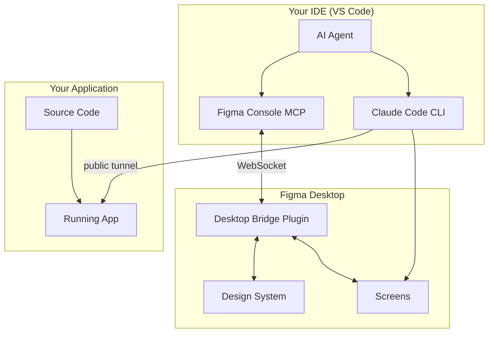

# Design-Code Workflow - Confluence Documentation

> **Copy/Paste Instructions:** 
> - Copy each section into Confluence
> - Use the Confluence editor to convert markdown to rich text
> - For diagrams: Use the "Mermaid Diagrams" macro if available, or paste the ASCII versions
> - For code blocks: Use the {code} macro
> - For info panels: Use the {info}, {tip}, {warning}, {note} macros

---

## Page: Design-Code Workflow Overview

### Title: Design-Code Workflow

**Status:** ✅ Active | **Last Updated:** [DATE] | **Owner:** [TEAM]

---

### Summary Panel
{panel:title=What is Design-Code Workflow?|borderStyle=solid|borderColor=#ccc|bgColor=#f5f5f5}

A platform-agnostic bidirectional workflow that enables:
* Creating screens in Figma using design system components via natural language
* Capturing running apps and converting them to editable Figma layers  
* Checking alignment between Figma designs and code
* Auditing design system health and token usage
* Seamless back-and-forth between designing and coding

{panel}

---

### Key Benefits

| Benefit | Description |
|---------|-------------|
| 🚀 **Faster iteration** | Skip manual design-to-code translation |
| 🔄 **System parity** | Design and code stay aligned automatically |
| 👥 **No role silos** | Anyone can design or code without switching contexts |
| ✅ **Quality control** | AI validates component usage and design tokens |
| 📸 **Reduced friction** | Capture live UI to Figma without screenshots |

---

### Design System Maturity Levels

{info:title=Understanding Maturity Levels}
The workflow adapts to your current design system maturity. Most projects start at Level 0 or 1.
{info}

| Level | Name | What You Have | Available Workflows |
|:-----:|------|---------------|---------------------|
| **0** | Greenfield | Empty Figma file | Create Base DS, Code to Canvas |
| **1** | Tokens Only | Variables in Figma | + Bind variables, Health checks |
| **2** | Components | Component library | + Screen creation, Reconciliation |
| **3** | Full System | + Storybook/Widgetbook | + Cross-platform health analysis |

{tip:title=Important}
Storybook, Widgetbook, and other documentation platforms are **optional**. They are not required for most workflows.
{tip}

---

### System Architecture Diagram

**ASCII Version (copy directly):**

```
┌─────────────────────────────────────────────────────────────────┐
│                        YOUR IDE (VS Code)                        │
│                                                                  │
│   ┌──────────────────┐      ┌────────────────────────────────┐  │
│   │                  │      │      Figma Console MCP          │  │
│   │   Your Code      │      │   ┌─────────────────────────┐   │  │
│   │                  │      │   │ • Create screens        │   │  │
│   │                  │      │   │ • Manage tokens         │   │  │
│   │                  │      │   │ • Health audits         │   │  │
│   │                  │      │   │ • Parity checks         │   │  │
│   └────────┬─────────┘      │   └─────────────────────────┘   │  │
│            │                └──────────────┬──────────────────┘  │
│            │ localhost                     │                     │
│            ▼                               │ WebSocket           │
│   ┌──────────────────┐                     ▼                     │
│   │ Claude Code CLI  │          ┌──────────────────────┐        │
│   │    (Bridge)      │          │   Figma Desktop      │        │
│   │                  │          │   ┌──────────────┐   │        │
│   │ generate_figma_  │─────────▶│   │Desktop Bridge│   │        │
│   │ design           │          │   │   Plugin     │   │        │
│   └──────────────────┘          │   └──────────────┘   │        │
│                                 │         │            │        │
│                                 │    ┌────┴────┐       │        │
│                                 │    ▼         ▼       │        │
│                                 │ [Design]  [Screens]  │        │
│                                 │ [System]             │        │
│                                 └──────────────────────┘        │
└─────────────────────────────────────────────────────────────────┘
```

**Mermaid Version (for Confluence Mermaid plugin):**



---

### Workflow Decision Tree

**ASCII Version:**

```
                    ┌─────────────────────────┐
                    │  What do you want to do? │
                    └───────────┬─────────────┘
        ┌───────────────────────┼───────────────────────┐
        ▼                       ▼                       ▼
┌───────────────┐     ┌─────────────────┐     ┌─────────────────┐
│ Create/Manage │     │ Create Screen   │     │ Capture Running │
│ Design System │     │ in Figma        │     │ UI to Figma     │
└───────┬───────┘     └────────┬────────┘     └────────┬────────┘
        │                      │                       │
        ▼                      ▼                       ▼
┌───────────────┐     ┌─────────────────┐     ┌─────────────────┐
│design-system- │     │ Level 2+?       │     │code-to-canvas-  │
│ops skill      │     │ Yes → figma-    │     │bridge skill     │
│(Level 0+)     │     │ screen-creation │     │(Level 0+)       │
└───────────────┘     │ No → Use Code-  │     └─────────────────┘
                      │ to-Canvas       │
                      └─────────────────┘

        ┌───────────────────────┼───────────────────────┐
        ▼                       ▼                       ▼
┌───────────────┐     ┌─────────────────┐     ┌─────────────────┐
│ Build Code    │     │ Check DS Health │     │ Reconcile       │
│ from Figma    │     │                 │     │ Captured Layers │
└───────┬───────┘     └────────┬────────┘     └────────┬────────┘
        │                      │                       │
        ▼                      ▼                       ▼
┌───────────────┐     ┌─────────────────┐     ┌─────────────────┐
│design-to-code │     │design-system-   │     │code-to-canvas-  │
│agent          │     │health skill     │     │reconciliation   │
│(Level 1+)     │     │(Level 1+)       │     │(Level 1+)       │
└───────────────┘     └─────────────────┘     └─────────────────┘
```

---

## Page: Setup Guide

### Title: Design-Code Workflow - Setup Guide

---

### Prerequisites Checklist

{panel:title=Required Components|borderStyle=solid|borderColor=#36B37E|bgColor=#E3FCEF}

| Component | Installation | Purpose |
|-----------|--------------|---------|
| ✅ Figma Desktop | [Download](https://www.figma.com/downloads/) | Required for Desktop Bridge |
| ✅ Desktop Bridge Plugin | Figma Plugins menu | Enables write access |
| ✅ Figma Access Token | [Create token](https://www.figma.com/developers/api#access-tokens) | API access |
| ✅ Claude Code CLI | `npm install -g @anthropic-ai/claude-code` | Code-to-Canvas |

{panel}

{panel:title=Optional Components|borderStyle=solid|borderColor=#0052CC|bgColor=#DEEBFF}

| Component | When Needed |
|-----------|-------------|
| ⬜ Component Library | Level 2+ workflows |
| ⬜ Storybook/Widgetbook | Level 3 health analysis |
| ⬜ Framework MCP tools | Enhanced code intelligence |
| ⬜ Public tunnel (ngrok, Cloudflare, etc.) | Localhost capture only |

{panel}

---

### Quick Setup

{code:language=bash|title=Run Setup Script}
# Clone the repository
git clone [REPO_URL] .design-code-workflow

# Run interactive setup
./scripts/setup.sh
{code}

The setup wizard will prompt for:
1. Design system maturity level (0-3)
2. Tech stack (React, Vue, Flutter, etc.)
3. Figma access token
4. Library file keys (if Level 1+)

---

### Configuration Files

**config/design-system.yaml**

{code:language=yaml|title=Design System Configuration}
name: "My Design System"
maturity_level: 0  # 0=greenfield, 1=tokens, 2=components, 3=full

libraries:
  working_file:
    file_key: "your-figma-file-key"
  foundations:
    enabled: false
    file_key: ""
  components:
    enabled: false
    file_key: ""

naming_conventions:
  component_prefix: ""
  variable_collections:
    colors: "Colors"
    spacing: "Spacing"
{code}

**config/tech-stack.yaml**

{code:language=yaml|title=Tech Stack Configuration}
framework: "react"  # react, vue, flutter, angular, svelte
package_manager: "npm"

dev_server:
  command: "npm run dev"
  default_port: 3000

design_tokens:
  enabled: false
  location: "src/tokens/"
  format: "typescript"

components:
  enabled: false
  location: "src/components/"
{code}

**.vscode/mcp.json**

{code:language=json|title=MCP Configuration}
{
  "mcpServers": {
    "figma-console": {
      "command": "npx",
      "args": ["-y", "figma-console-mcp@latest"],
      "env": {
        "FIGMA_ACCESS_TOKEN": "figd_YOUR_TOKEN",
        "ENABLE_MCP_APPS": "true"
      }
    },
    "figma-code-to-canvas": {
      "type": "http",
      "url": "https://mcp.figma.com/mcp"
    }
  }
}
{code}

---

## Page: Workflows Reference

### Title: Design-Code Workflow - Use Cases

---

### Workflow Quick Reference

| Use Case | Skill/Agent | Min Level | Example Prompt |
|----------|-------------|:---------:|----------------|
| Create Base DS | design-system-ops | 0 | "Create a color palette in Figma" |
| DS from Code | design-system-ops | 0 | "Sync my code tokens to Figma" |
| Code to Canvas | code-to-canvas-bridge | 0 | "Capture my app to Figma" |
| Create Screen | figma-screen-creation | 2 | "Create a login screen in Figma" |
| Build from Figma | design-to-code | 1 | "Implement this Figma design" |
| Reconcile Layers | code-to-canvas-reconciliation | 1 | "Convert to DS components" |
| DS Health Check | design-system-health | 1 | "Audit my design system" |

---

### Workflow 1: Create Base Design System

{info:title=Maturity Level: 0+}
Works with an empty Figma file. No prerequisites needed.
{info}

**Steps:**

1. Ask the AI to create tokens:
{code:language=none|title=Example Prompt}
Create a color palette in Figma with:
- Primary: blue (#0066FF)
- Secondary: gray (#6B7280)  
- Success: green (#10B981)
- Warning: orange (#F59E0B)
- Error: red (#EF4444)
Add light and dark mode variants.
{code}

2. Add spacing tokens:
{code:language=none}
Create spacing tokens: 4px (xs), 8px (sm), 16px (md), 24px (lg), 32px (xl)
{code}

3. Update your config to Level 1 after tokens are created

**Flow Diagram:**

```
┌──────────┐    ┌───────────────┐    ┌──────────────┐    ┌────────────┐
│  Prompt  │───▶│ Agent creates │───▶│  Variables   │───▶│  Update    │
│ "Create  │    │ tokens via    │    │  created in  │    │  config to │
│ palette" │    │ MCP tools     │    │  Figma       │    │  Level 1   │
└──────────┘    └───────────────┘    └──────────────┘    └────────────┘
```

---

### Workflow 2: Code to Canvas

{info:title=Maturity Level: 0+}
Capture any running UI to Figma. Works with any tech stack.
{info}

**Steps:**

```
Step 1: Start your app
────────────────────────────────────────
$ npm run dev
# or: flutter run -d chrome --web-port=8080
# or: ng serve

Step 2: Start a tunnel (ngrok or equivalent)
────────────────────────────────────────
$ ngrok http 3000
# Copy the https URL (e.g., https://abc123.ngrok-free.dev)

Step 3: Open tunnel URL in browser
────────────────────────────────────────
Navigate to the URL and click through any interstitial pages

Step 4: In Claude Code CLI
────────────────────────────────────────
$ claude
> Capture https://abc123.ngrok-free.dev to my Figma file
> https://figma.com/design/YOUR_FILE_KEY
> Create a page called "App Capture"
```

**Flow Diagram:**

```
┌─────────┐    ┌─────────┐    ┌─────────────┐    ┌─────────────┐
│  Start  │───▶│  Start  │───▶│   Claude    │───▶│   Figma     │
│   App   │    │ tunnel  │    │   Code      │    │   Page      │
│         │    │         │    │   Capture   │    │   Created   │
└─────────┘    └─────────┘    └─────────────┘    └─────────────┘
     │              │                │
     ▼              ▼                ▼
 localhost      https://...     generate_figma_
  :3000       tunnel-url          design
```

---

### Workflow 3: Create Screens in Figma

{warning:title=Maturity Level: 2+ Required}
Requires a component library in Figma. If you don't have one, use Code-to-Canvas instead.
{warning}

**Steps:**

1. Ask to create a screen:
{code:language=none|title=Example Prompt}
Create a login screen in Figma with:
- App logo at top
- Email and password fields
- Login button (primary)
- "Forgot password" link
- "Sign up" link at bottom
{code}

2. Agent workflow:
   - Searches component library
   - Creates Section container
   - Instantiates DS components
   - Binds variables
   - Takes screenshot for validation

3. Iterate if needed:
{code:language=none}
Move the logo higher and add more spacing between inputs.
{code}

**Flow Diagram:**

```
┌──────────┐    ┌──────────┐    ┌──────────┐    ┌──────────┐    ┌──────────┐
│  Prompt  │───▶│  Search  │───▶│  Create  │───▶│  Bind    │───▶│  Visual  │
│ "Create  │    │  compo-  │    │  instan- │    │  varia-  │    │  valida- │
│  screen" │    │  nents   │    │  ces     │    │  bles    │    │  tion    │
└──────────┘    └──────────┘    └──────────┘    └──────────┘    └──────────┘
```

---

### Workflow 4: Build Code from Figma

{info:title=Maturity Level: 1+}
Get implementation guidance from Figma designs.
{info}

**Steps:**

1. Share Figma link:
{code:language=none}
Implement this Figma design:
https://figma.com/design/FILE_KEY/File-Name?node-id=1-2
{code}

2. Agent extracts:
   - Layout structure
   - Component mappings
   - Token references

3. Receive implementation guidance:

| Figma Element | Code Component | Notes |
|---------------|----------------|-------|
| Button/Primary | `<Button variant="primary">` | Use for main actions |
| Card | `<Card>` | Container component |
| Input | `<TextField>` | With validation |

---

### Workflow 5: Reconcile Code-to-Canvas Output

{info:title=Maturity Level: 1+ (2+ for full replacement)}
Convert generic captured layers to DS components.
{info}

**When to use:** After Code-to-Canvas capture when you want system-aligned designs.

**Steps:**

1. After capture, ask:
{code:language=none}
Reconcile the captured screen with our design system.
Replace generic layers with DS components.
{code}

2. Agent workflow:
   - Analyzes captured layers
   - Creates parallel section
   - Instantiates DS components (Level 2+)
   - Binds variables (Level 1+)
   - Takes comparison screenshot

---

### Visual Validation Loop

{tip:title=Always Validate}
After any Figma modification, the AI captures a screenshot to verify the result.
{tip}

```
    ┌─────────┐
    │ Create  │
    └────┬────┘
         │
         ▼
    ┌─────────┐     ┌─────────┐
    │Screenshot│────▶│ Analyze │
    └─────────┘     └────┬────┘
         ▲               │
         │               ▼
    ┌────┴────┐     ┌─────────┐
    │ Verify  │◀────│ Iterate │
    └─────────┘     └─────────┘
```

**Checks performed:**
- ✅ Proper alignment and spacing
- ✅ Correct component usage
- ✅ Variables bound (no hardcoded values)
- ✅ No floating elements outside containers

---

## Page: Troubleshooting

### Title: Design-Code Workflow - Troubleshooting

---

### Common Issues

{panel:title=Figma Console Not Connecting|borderStyle=solid|borderColor=#FF5630|bgColor=#FFEBE6}

**Symptoms:** MCP tools fail, "connection refused" errors

**Solutions:**
1. Open Figma Desktop (not browser)
2. Run Desktop Bridge plugin (Plugins menu → figma-desktop-bridge)
3. Restart VS Code
4. Check ports 9223-9232 are available

{panel}

{panel:title=Code-to-Canvas Captures Tunnel Page|borderStyle=solid|borderColor=#FF5630|bgColor=#FFEBE6}

**Symptoms:** Captured UI shows tunnel interstitial, not your app

**Solutions:**
1. Open tunnel URL in browser first
2. Click "Visit Site" on interstitial
3. Then run the capture command

{panel}

{panel:title=generate_figma_design Not Available|borderStyle=solid|borderColor=#FF5630|bgColor=#FFEBE6}

**Symptoms:** Tool not found in VS Code

**Solution:** This tool only works in Claude Code CLI, not VS Code.
{code:language=bash}
# Use Claude Code CLI
claude
> Capture [url] to [figma-file]
{code}

{panel}

{panel:title=Components Not Found|borderStyle=solid|borderColor=#FFAB00|bgColor=#FFFAE6}

**Symptoms:** Search returns no results

**Solutions:**
1. Try broader search terms ("Button" instead of "Primary Button")
2. Check if `component_prefix` is configured correctly
3. Run empty search to see all available components:
{code:language=none}
Search for components with query: ""
{code}

{panel}

{panel:title=Variables Not Binding|borderStyle=solid|borderColor=#FFAB00|bgColor=#FFFAE6}

**Symptoms:** Colors remain hardcoded

**Solutions:**
1. Verify collection names in config match Figma
2. Check `foundations.enabled: true` in config
3. Ensure variable type matches (COLOR for fills, FLOAT for spacing)

{panel}

---

### Quick Fixes Reference

| Issue | Quick Fix |
|-------|-----------|
| MCP not responding | Restart VS Code |
| Plugin not connecting | Re-run Desktop Bridge in Figma |
| Token expired | Generate new token, update mcp.json |
| Wrong file | Check file_key in config |
| tunnel not working | Check tunnel status (ngrok example: `ngrok config check`) |

---

## Page: Tools Reference

### Title: Design-Code Workflow - MCP Tools

---

### Figma Console MCP Tools

**Token Management**

| Tool | Purpose | Level |
|------|---------|:-----:|
| `figma_setup_design_tokens` | Create complete token system atomically | 0+ |
| `figma_batch_create_variables` | Bulk create variables | 0+ |
| `figma_batch_update_variables` | Bulk update variable values | 1+ |
| `figma_get_variables` | Retrieve token data | 1+ |
| `figma_create_variable_collection` | Create new collection | 0+ |
| `figma_add_mode` | Add mode (e.g., Dark) | 1+ |

**Component Operations**

| Tool | Purpose | Level |
|------|---------|:-----:|
| `figma_search_components` | Find components | 2+ |
| `figma_instantiate_component` | Create instances | 2+ |
| `figma_set_instance_properties` | Configure instances | 2+ |
| `figma_get_component_details` | Deep inspection | 2+ |
| `figma_add_component_property` | Add properties | 2+ |

**General Operations**

| Tool | Purpose | Level |
|------|---------|:-----:|
| `figma_execute` | Run Plugin API code | 0+ |
| `figma_take_screenshot` | Visual capture | 0+ |
| `figma_audit_design_system` | Health audit | 1+ |
| `figma_create_child` | Add child nodes | 0+ |

---

### Claude Code Tools

| Tool | Purpose |
|------|---------|
| `generate_figma_design` | Capture running UI to Figma |

{note}
This tool only works in Claude Code CLI, not in VS Code.
{note}

---

## Page: Framework Setup

### Title: Design-Code Workflow - Framework Configuration

---

### React / Next.js

{code:language=yaml|title=tech-stack.yaml}
framework: "react"
package_manager: "npm"
dev_server:
  command: "npm run dev"
  default_port: 3000
design_tokens:
  enabled: true
  location: "src/tokens/"
  format: "typescript"
components:
  enabled: true
  location: "src/components/"
  naming_convention: "PascalCase"
{code}

---

### Vue / Nuxt

{code:language=yaml|title=tech-stack.yaml}
framework: "vue"
package_manager: "npm"
dev_server:
  command: "npm run dev"
  default_port: 5173
design_tokens:
  format: "typescript"
  location: "src/tokens/"
components:
  location: "src/components/"
{code}

---

### Flutter

{code:language=yaml|title=tech-stack.yaml}
framework: "flutter"
package_manager: "pub"
dev_server:
  command: "flutter run -d chrome --web-port=8080"
  default_port: 8080
design_tokens:
  format: "dart"
  location: "lib/theme/"
components:
  location: "lib/widgets/"
  naming_convention: "PascalCase"
{code}

**Additional MCP:** Add to `.vscode/mcp.json`:
{code:language=json}
{
  "dart": {
    "command": "dart",
    "args": ["mcp-server"]
  }
}
{code}

---

### Angular

{code:language=yaml|title=tech-stack.yaml}
framework: "angular"
package_manager: "npm"
dev_server:
  command: "ng serve"
  default_port: 4200
components:
  location: "src/app/components/"
  naming_convention: "kebab-case"
{code}

---

### Svelte / SvelteKit

{code:language=yaml|title=tech-stack.yaml}
framework: "svelte"
package_manager: "npm"
dev_server:
  command: "npm run dev"
  default_port: 5173
components:
  location: "src/lib/components/"
  naming_convention: "PascalCase"
{code}

---

## Quick Reference Card

{panel:title=Quick Commands|borderStyle=solid|borderColor=#0052CC|bgColor=#DEEBFF}

**Create tokens (Level 0+):**
```
"Create a color palette in Figma"
```

**Capture app (Level 0+):**
```bash
npm run dev
ngrok http 3000
# In Claude Code: "Capture [tunnel-url] to [figma-file]"
```

**Create screen (Level 2+):**
```
"Create a login screen in Figma"
```

**Health check (Level 1+):**
```
"Audit my design system"
```

**Reconcile (Level 1+):**
```
"Convert captured layers to DS components"
```

{panel}

---

**Key Principle:**
{quote}
"Code to Design isn't the point. System Parity is."
{quote}
