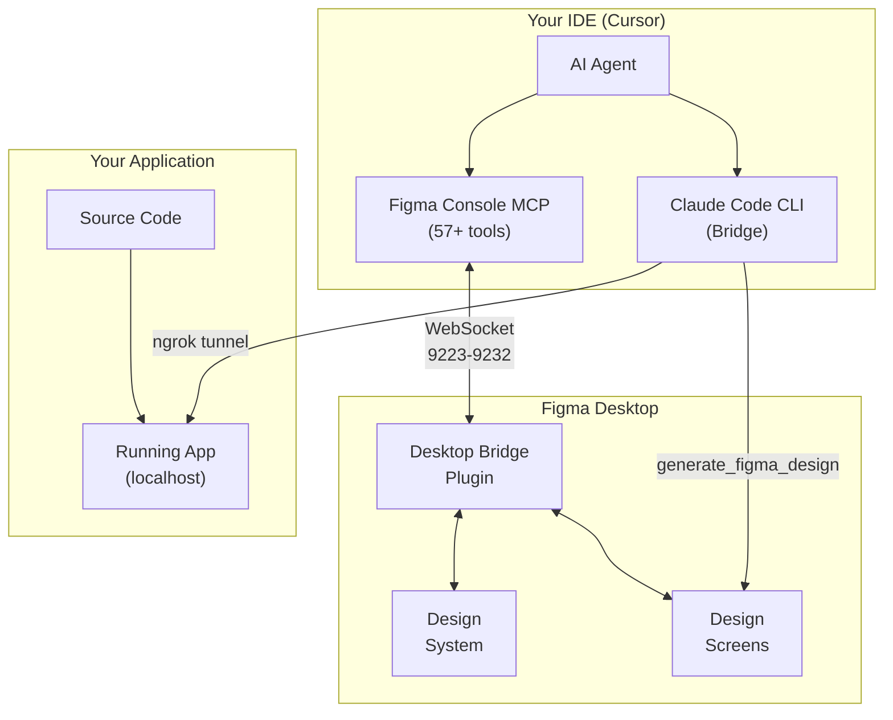
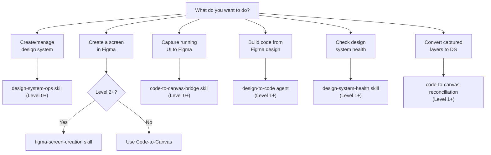
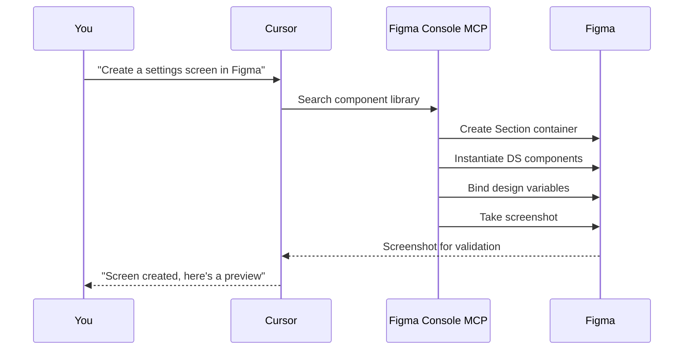
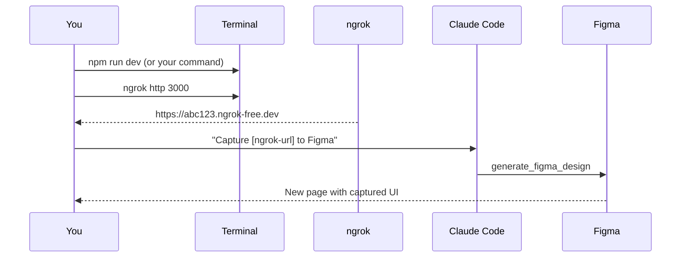
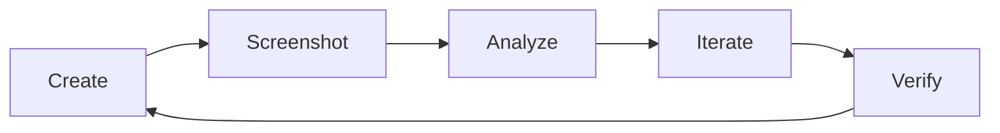
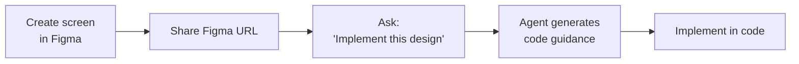
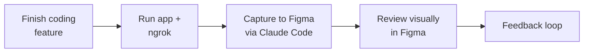
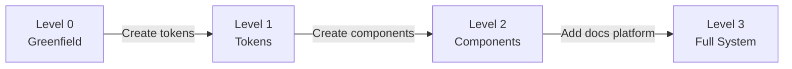

# Design-Code Workflow

Platform-agnostic bidirectional design-code workflow for any tech stack. Create, capture, and maintain design-code parity using AI-powered tools.

---

## Summary

### What it does

- Creates screens in Figma using design system components via natural language prompts
- Captures running apps and converts them to editable Figma layers
- Checks alignment between Figma designs and code
- Audits design system health and token usage
- Enables seamless back-and-forth between designing and coding
- Works at any design system maturity level (from greenfield to full system)

### Why it is useful

- **Faster iteration**: Skip manual design-to-code translation
- **System parity**: Design and code stay aligned automatically
- **No role silos**: Anyone can design or code without switching contexts
- **Quality control**: AI validates component usage and design tokens
- **Reduced friction**: Capture live UI to Figma for review without screenshots
- **Framework agnostic**: Works with React, Vue, Flutter, Angular, Svelte, and more

### What it includes

- **Figma Console MCP**: 57+ tools for full Figma read/write access via AI
- **Code-to-Canvas Bridge**: Capture localhost UI to Figma via Claude Code CLI
- **Configuration System**: YAML-based setup for any tech stack and design system
- **Skills**: Reusable workflows for screen creation, reconciliation, and capture
- **Setup Script**: One-command installation with interactive configuration
- **Documentation**: Complete guides and troubleshooting

---

## Overview

Two complementary tools working together:

**Figma Console MCP**
- Full read/write access to Figma
- Design system operations
- Creating screens with DS components
- Audits and parity checks

**Code-to-Canvas (via Claude Code)**
- Captures running UI as editable Figma layers
- Rapid prototyping
- Stakeholder review

> **Key principle:** "Code to Design isn't the point. System Parity is."

---

## Design System Maturity Levels

The workflow adapts to your current design system maturity:

| Level | Name | What You Have | Available Workflows |
|-------|------|---------------|---------------------|
| **0** | Greenfield | Empty Figma file | Create Base DS, Code to Canvas |
| **1** | Tokens Only | Variables in Figma | + Bind variables, Health checks |
| **2** | Components | Component library | + Screen creation, Reconciliation |
| **3** | Full System | + Storybook/Widgetbook | + Cross-platform health analysis |

**Most projects start at Level 0 or 1.** Documentation platforms like Storybook or Widgetbook are optional extensions, not requirements.

---

## System Architecture



---

## Workflow Decision Tree



---

## Setup Requirements

### Quick Setup

Run the setup script:
```bash
./scripts/setup.sh
```

Then follow the prompts for your specific configuration.

### One-Time Setup Checklist

| Component | How to Install | Purpose | Required? |
|-----------|----------------|---------|-----------|
| Figma Desktop | [figma.com/downloads](https://www.figma.com/downloads/) | Required for Desktop Bridge | **Yes** |
| Desktop Bridge Plugin | Plugins menu in Figma | Enables full write access | **Yes** |
| Figma Access Token | [Create token](https://www.figma.com/developers/api#access-tokens) | REST API access | **Yes** |
| Claude Code CLI | `npm install -g @anthropic-ai/claude-code` | Code-to-Canvas bridge | **Yes** |
| ngrok | `brew install ngrok` or `npm install -g ngrok` | Expose localhost for capture | **Yes** |
| Component Library | Create in Figma | Screen creation | No (Level 2+) |
| Storybook/Widgetbook | Framework-specific | Cross-platform health | No (Level 3) |

### Configuration Files

**Design System** (`config/design-system.yaml`):

```yaml
name: "My Design System"
maturity_level: 0  # 0-3

libraries:
  working_file:
    file_key: "your-figma-file-key"
  foundations:
    enabled: false
    file_key: ""
  components:
    enabled: false
    file_key: ""

naming_conventions:
  component_prefix: ""
  variable_collections:
    colors: "Colors"
    spacing: "Spacing"
```

**Tech Stack** (`config/tech-stack.yaml`):

```yaml
framework: "react"  # or vue, flutter, angular, svelte, etc.
dev_server:
  command: "npm run dev"
  default_port: 3000
```

**MCP Config** (`.cursor/mcp.json`):

```json
{
  "mcpServers": {
    "figma-console": {
      "command": "npx",
      "args": ["-y", "figma-console-mcp@latest"],
      "env": {
        "FIGMA_ACCESS_TOKEN": "figd_YOUR_TOKEN",
        "ENABLE_MCP_APPS": "true"
      }
    },
    "figma-code-to-canvas": {
      "type": "http",
      "url": "https://mcp.figma.com/mcp"
    }
  }
}
```

---

## Workflow Reference

| Use Case | Tool | Min Level | Example Prompt |
|----------|------|-----------|----------------|
| Create Base DS | design-system-ops | 0 | "Create a color palette in Figma" |
| DS from Code | design-system-ops | 0 | "Sync my code tokens to Figma" |
| Capture Running UI | code-to-canvas-bridge | 0 | "Capture localhost to Figma" |
| Create Screen | figma-screen-creation | 2 | "Create a login screen in Figma" |
| Build from Design | design-to-code agent | 1 | "Implement this Figma design" |
| Reconcile Layers | code-to-canvas-reconciliation | 1 | "Convert to DS components" |
| Audit DS Health | design-system-health | 1 | "Check design system health" |
| Check Parity | design-to-code agent | 1 | "Compare design to code" |

---

## Design System Operations

Advanced operations for managing the design system via natural language.

### Token Management

**Create tokens from scratch:**
```
Create a color palette with primary (blue), secondary (gray), 
success (green), warning (orange), and error (red).
Add light and dark mode variants.
```

**Reorganize variables:**
```
Reorganize the color variables by grouping them into semantic 
categories (backgrounds, text, borders, interactive)
```

**Bind variables to elements:**
```
Bind the background color of this card to the 'surface-primary' 
variable from the Colors collection
```

**Create spacing tokens:**
```
Create spacing tokens: 4px (xs), 8px (sm), 16px (md), 24px (lg), 32px (xl)
```

**Batch update variable values:**
```
Update all 'brand-primary' color references to use the new purple (#7C3AED)
```

### Component Operations (Level 2+)

**Add component variants:**
```
Add a 'destructive' variant to the Button component with red styling
```

**Replace/swap components:**
```
Replace all instances of the old Card component with the new Card component
```

**Update component properties:**
```
Add a 'showIcon' boolean property to the ListItem component
```

**Document components:**
```
Add descriptions to all Button variants explaining when to use each
```

### Tools Used

| Tool | Purpose |
|------|---------|
| `figma_setup_design_tokens` | Create complete token collections atomically |
| `figma_batch_create_variables` | Create multiple variables at once |
| `figma_batch_update_variables` | Update variable values in bulk |
| `figma_add_component_property` | Add properties to components |
| `figma_set_description` | Document components and variants |
| `figma_search_components` | Find components to modify or replace |

---

## Quick Start: Create Screen in Figma



**Just ask:**
```
Create a settings screen in Figma with toggles for notifications, 
dark mode, and location services.
```

**Requirements:** Level 2+ (component library must exist)

---

## Quick Start: Capture App to Figma



**Step by step:**

1. **Start your app**
```bash
npm run dev  # or flutter run -d chrome --web-port=8080
```

2. **Start ngrok**
```bash
ngrok http 3000  # your port
```

3. **Open ngrok URL in browser** (clear any interstitial)

4. **In Claude Code CLI**
```
Capture https://YOUR_NGROK_URL to this Figma file:
https://www.figma.com/design/YOUR_FILE_KEY

Create a page called "App Capture"
```

**Requirements:** Level 0+ (works with any running UI)

---

## Visual Validation Loop



After each change, the agent captures a screenshot to verify:
- Alignment and spacing
- Correct component usage
- Variables bound (no hardcoded values)

---

## Key Tools

### Figma Console MCP

| Tool | Purpose | Level |
|------|---------|-------|
| `figma_execute` | Run any Figma Plugin API code | 0+ |
| `figma_setup_design_tokens` | Create token collections atomically | 0+ |
| `figma_batch_create_variables` | Bulk token creation | 0+ |
| `figma_search_components` | Find components by name | 2+ |
| `figma_instantiate_component` | Create component instances | 2+ |
| `figma_audit_design_system` | Full DS health audit | 1+ |
| `figma_take_screenshot` | Capture for validation | 0+ |

### Claude Code

| Tool | Purpose |
|------|---------|
| `generate_figma_design` | Capture running UI to Figma |

---

## Task Workflows

### Designing → Coding



### Coding → Design Review



### Level Progression



---

## Framework-Specific Setup

### React / Next.js

```yaml
# tech-stack.yaml
framework: "react"
dev_server:
  command: "npm run dev"
  default_port: 3000
design_tokens:
  format: "typescript"
  location: "src/tokens/"
```

### Vue / Nuxt

```yaml
framework: "vue"
dev_server:
  command: "npm run dev"
  default_port: 5173
```

### Flutter

```yaml
framework: "flutter"
dev_server:
  command: "flutter run -d chrome --web-port=8080"
  default_port: 8080
design_tokens:
  format: "dart"
  location: "lib/theme/"
```

### Angular

```yaml
framework: "angular"
dev_server:
  command: "ng serve"
  default_port: 4200
```

### Svelte / SvelteKit

```yaml
framework: "svelte"
dev_server:
  command: "npm run dev"
  default_port: 5173
```

---

## Troubleshooting

| Problem | Solution |
|---------|----------|
| Figma Console not connecting | Open Figma Desktop, run Desktop Bridge plugin, restart Cursor |
| Code-to-Canvas captures ngrok page | Open ngrok URL in browser first, click through interstitial |
| Screenshots returning errors | Try without nodeId, check token scopes |
| generate_figma_design not available | Only works in Claude Code CLI, not Cursor |
| Components not found | Try broader search terms, check component prefix in config |
| Variables not binding | Ensure collection names match config |

---

## Quick Reference

**Create tokens:**
```
Ask: "Create a color palette in Figma"
```

**Create screen (Level 2+):**
```
Ask: "Create a [screen] in Figma"
```

**Capture app:**
```bash
# Start app
npm run dev

# Start tunnel
ngrok http 3000

# In Claude Code
"Capture [ngrok-url] to [figma-file]"
```

**Check health:**
```
Ask: "Audit design system health"
```

**Reconcile layers:**
```
Ask: "Convert captured layers to DS components"
```

---

## Upgrading Maturity Levels

### Level 0 → Level 1

1. Create tokens using `design-system-ops` skill
2. Update `config/design-system.yaml`:
   ```yaml
   maturity_level: 1
   libraries:
     foundations:
       enabled: true
       file_key: "your-file-key"
   ```

### Level 1 → Level 2

1. Create component library in Figma
2. Update config:
   ```yaml
   maturity_level: 2
   libraries:
     components:
       enabled: true
       file_key: "your-components-file-key"
   ```

### Level 2 → Level 3

1. Set up Storybook, Widgetbook, or similar
2. Update config:
   ```yaml
   maturity_level: 3
   documentation:
     enabled: true
     platform: "storybook"
     url: "https://storybook.myapp.dev"
   ```

---

## Resources

- [Figma Console MCP Docs](https://docs.figma-console-mcp.southleft.com)
- [Official Figma MCP](https://developers.figma.com/docs/figma-mcp-server/)
- [System Parity Article](https://southleft.com/insights/design-systems/code-to-design-isnt-the-point-system-parity-is/)
