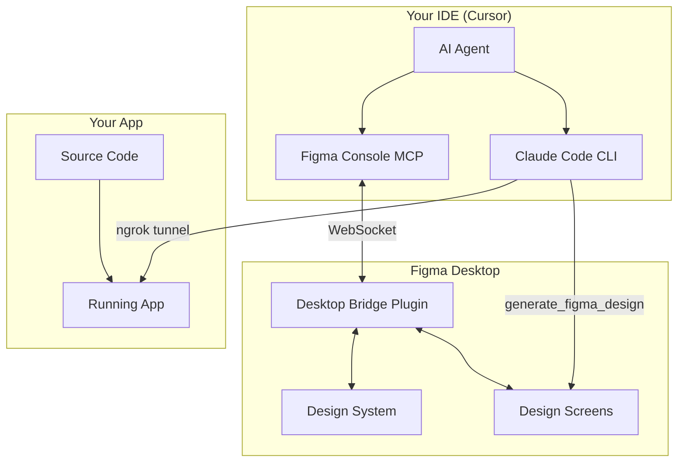
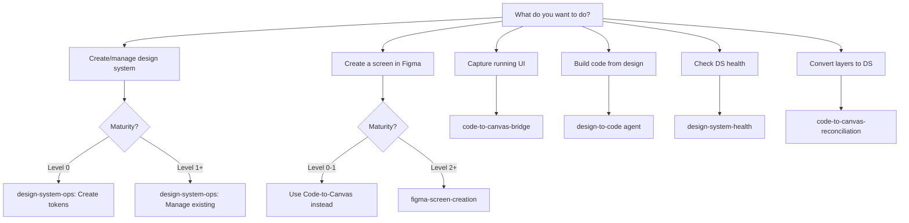

# Workflow Reference

Complete reference for all design-code workflows.

## Overview

Two complementary MCP tools working together:

| Tool | Purpose | Direction |
|------|---------|-----------|
| **Figma Console MCP** | Full read/write Figma access | Figma ↔ Code |
| **Code-to-Canvas** (Claude Code) | Capture running UI | Code → Figma |

## System Architecture



## Workflow Decision Tree



## Visual Validation Loop

All design work follows this pattern:

```
Create → Screenshot → Analyze → Iterate → Verify
```

Use `figma_take_screenshot` after each significant change to verify visual correctness.

## Workflow Details

### 1. Create Base Design System (Level 0)

**Purpose:** Start a design system from scratch.

**Steps:**
1. Ask: "Create a color palette in Figma"
2. Agent uses `figma_setup_design_tokens`
3. Creates variable collections for colors, spacing, typography
4. Visual validation via screenshot

**Tools:**
- `figma_setup_design_tokens` - Atomic token creation
- `figma_batch_create_variables` - Bulk variable creation
- `figma_take_screenshot` - Validation

### 2. Create DS from Existing Code (Level 0+)

**Purpose:** Sync code tokens to Figma.

**Steps:**
1. Configure `tech-stack.yaml` with token locations
2. Ask: "Create Figma tokens from my code"
3. Agent reads code token files
4. Creates matching variables in Figma
5. Validates naming consistency

**Prerequisites:**
- `design_tokens.enabled: true` in tech-stack.yaml
- Token files at `design_tokens.location`

### 3. Code to Canvas (Level 0+)

**Purpose:** Capture running UI as Figma layers.

**Steps:**
1. Start dev server: `{{dev_server.command}}`
2. Start ngrok: `ngrok http {{port}}`
3. In Claude Code: "Capture https://[ngrok-url] to Figma"
4. Captured layers appear in Figma file

**Tools:**
- Claude Code CLI with Figma MCP
- `generate_figma_design` tool

**Important:** Open ngrok URL in browser first to bypass interstitial.

### 4. Create Screens in Figma (Level 2+)

**Purpose:** Build screens using DS components.

**Steps:**
1. Ask: "Create a login screen in Figma"
2. Agent searches component library
3. Instantiates components from DS
4. Binds variables instead of hardcoding
5. Visual validation loop

**Workflow:**
```
Search → Instantiate → Configure → Bind Variables → Validate
```

**Tools:**
- `figma_search_components`
- `figma_instantiate_component`
- `figma_set_instance_properties`
- `figma_take_screenshot`

### 5. Build Code from Figma (Level 1+)

**Purpose:** Get implementation guidance from designs.

**Steps:**
1. Share Figma URL with agent
2. `design-to-code` agent extracts context
3. Maps to your component library
4. Outputs implementation guidance

**Output includes:**
- Component mapping table
- Token references
- Layout structure
- Implementation notes

### 6. Reconcile Code-to-Canvas (Level 1+)

**Purpose:** Convert captured layers to DS components.

**Steps:**
1. After Code-to-Canvas capture
2. Ask: "Reconcile captured layers with DS"
3. Agent analyzes captured content
4. Creates parallel structure with DS components
5. Binds variables
6. Visual comparison

**Level 1:** Can bind variables only
**Level 2+:** Full component replacement

### 7. Design System Health (Level 1+)

**Purpose:** Audit DS quality.

**Steps:**
1. Ask: "Audit my design system health"
2. Agent runs `figma_audit_design_system`
3. Evaluates naming, tokens, components
4. Produces scored report

**Metrics:**
- Naming conventions (0-100)
- Token architecture (0-100)
- Component metadata (0-100)
- Accessibility (0-100)
- Consistency (0-100)

### 8. Iterate Code

**Purpose:** Keep design and code in sync.

**Methods:**
1. **Design-first:** Update Figma, use design-to-code for changes
2. **Code-first:** Update code, capture to Figma, reconcile
3. **Parity check:** Compare current state

## Key MCP Tools

### Figma Console MCP

| Tool | Purpose |
|------|---------|
| `figma_execute` | Run Figma Plugin API code |
| `figma_search_components` | Find components |
| `figma_instantiate_component` | Create instances |
| `figma_setup_design_tokens` | Create token system |
| `figma_batch_create_variables` | Bulk create variables |
| `figma_audit_design_system` | Health audit |
| `figma_take_screenshot` | Visual capture |
| `figma_get_variables` | Retrieve tokens |

### Claude Code Figma MCP

| Tool | Purpose |
|------|---------|
| `generate_figma_design` | Capture UI to Figma |

## Troubleshooting

| Issue | Cause | Solution |
|-------|-------|----------|
| Figma Console not connecting | Desktop Bridge not running | Open Figma Desktop, run plugin |
| Components not found | Wrong search terms | Try broader search, check prefix |
| Variables not binding | Wrong collection | Verify collection names in config |
| Code-to-Canvas fails | Localhost not accessible | Use ngrok tunnel |
| Screenshots error | Invalid node ID | Try without nodeId parameter |

## Best Practices

1. **Always validate visually** - Screenshot after each change
2. **Use DS components** - Never create snowflakes at Level 2+
3. **Bind variables** - No hardcoded colors
4. **Check config first** - Skills read from config files
5. **Upgrade gradually** - Move through maturity levels step by step
